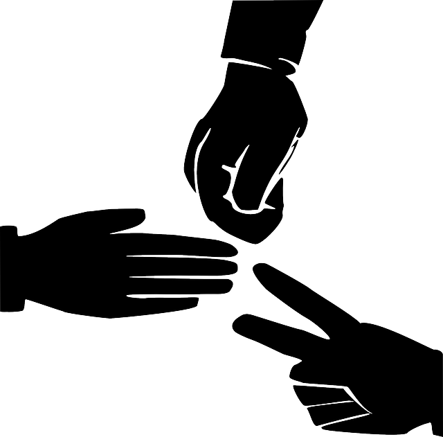

# stone_paper_sicssor

- In this model we are basically creating a deep learning model for classification of images as rock, paper, sicssor.
- I m using keras from tensorflow for creating the model .
